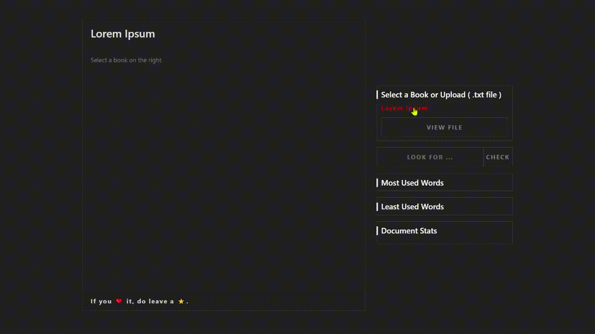

<h1 align="center"> BITS & PIECES 🧩</h1>
<h3 align="center">Lets you know 😇 every bit of the doc 📄.</h3>

  

Demo Link ☸ - [Bits & Pieces](https://harshitjain-hj.github.io/bits-and-pieces)

[Sceenshot](./assets/screenshots/screenshot.png)

## What it is?

Lets you know some insights about the selecte/uploaded document.

- 5 **most used** words.
- 5 **least used** words.
- Document stats like **document length** and **word count**.

## Fun fact or say Nerd fact-

| Book                                    | Most used word                                                                                                                      |
| --------------------------------------- | ----------------------------------------------------------------------------------------------------------------------------------- |
| Book 1 - **The Philosopher's Stone**🧱  | **Harry** : 1559 Time(s), **Potter** : 439 Time(s), **Stone** : 422 Time(s), **Ron** : 410 Time(s), **Out** : 372 Time(s)           |
| Book 2 - **The Chamber of Secrets**🤫   | **Harry** : 1892 Time(s), **Ron** : 657 Time(s), **Potter** : 503 Time(s), **Chamber** : 463 Time(s), **Secrets** : 428 Time(s)     |
| Book 3 - **The Prisoner of Azkaban**🔒  | **Harry** : 2355 Time(s), **Ron** : 722 Time(s), **Hermione** : 650 Time(s), **Potter** : 584 Time(s), **Azkaban** : 532 Time(s)    |
| Book 4 - **The Goblet of Fire**🔥       | **Harry** : 3742 Time(s), **Potter** : 1030 Time(s), **Ron** : 979 Time(s), **Fire** : 927 Time(s), **Up** : 886 Time(s)            |
| Book 5 - **The Order of the Phoenix**🐦 | **Harry** : 3828 Time(s), **Potter** : 1379 Time(s), **Hermione** : 1242 Time(s), **Order** : 1208 Time(s), **Ron** : 1191 Time(s)  |
| Book 6 - **The Half Blood Prince**🩸    | **Harry** : 3336 Time(s), **Dumbledore** : 937 Time(s), **Potter** : 823 Time(s), **Ron** : 793 Time(s), **Half** : 791 Time(s)     |
| Book 7 - **The Deathly Hallows**⚰       | **Harry** : 3745 Time(s), **Hermione** : 1153 Time(s), **Ron** : 1068 Time(s), **Potter** : 1058 Time(s), **Hallows** : 923 Time(s) |
